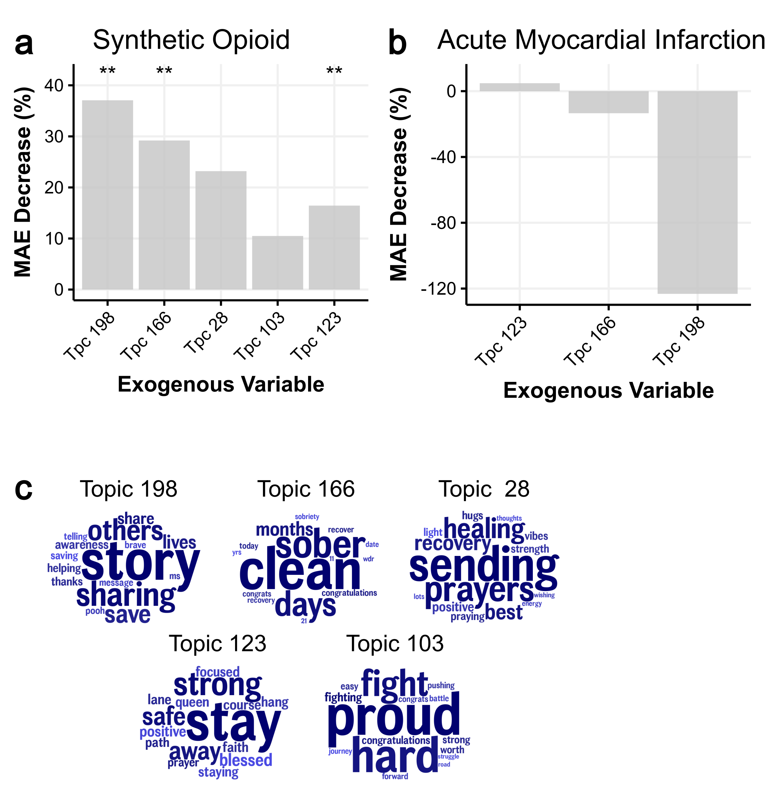

# TikTok Is A Valuable Data Source For Tracking The Opioid Epidemic

## Abstract
Monitoring opioid-related chatter on social media can predict the course of opioid addiction and overdose epidemic. We assessed the utility of TikTok, a prominent short video-based social media platform, as a means of tracking the opioid addiction and overdose crisis. We collected 569,581 TikTok comments (posted between January 2021 and June 2025) from 48,306 opioid-related videos, making this study the first large-scale analysis of TikTok comments for opioid surveillance. We extracted 200 topics from these comments using Latent Dirichlet Allocation (LDA) and incorporated the topics into ARIMA models that forecast synthetic opioid mortality over 6-month horizons. We also analyzed conversational patterns using the LIWC2015 pronoun dictionaries and GPT o1-mini. We found that (1) incorporating TikTok topics into the ARIMA models reduced forecasting Mean Absolute Error by up to 37% (2) the topics spanned five broad themes (use, source, recovery, harm reduction, loss), showing the diversity of opioid discourse on TikTok, and (3) TikTok comments included first-person, second-person, and third-person accounts of opioid use (i.e., personal use, engaging with other users in conversation about their use, and relating views of others’ use, respectively). These findings emphasize the usefulness of TikTok comments as a data source for opioid use surveillance.
    

## Data
- Derived data used in and generated by this study is available here: [link](https://drive.google.com/drive/folders/1hDhVNtCH-m1_n7qJQQIszXz1bwemelbU?usp=sharing)
- Raw comments and video descriptions are available upon request.
- SQL database tables generated by DLATK are provided as .db file here: [link](https://drive.google.com/drive/folders/1hDhVNtCH-m1_n7qJQQIszXz1bwemelbU?usp=sharing)

## Analysis Notebook
The analysis notebooks for this study are located in `./notebooks/` and are numbered sequentially. 